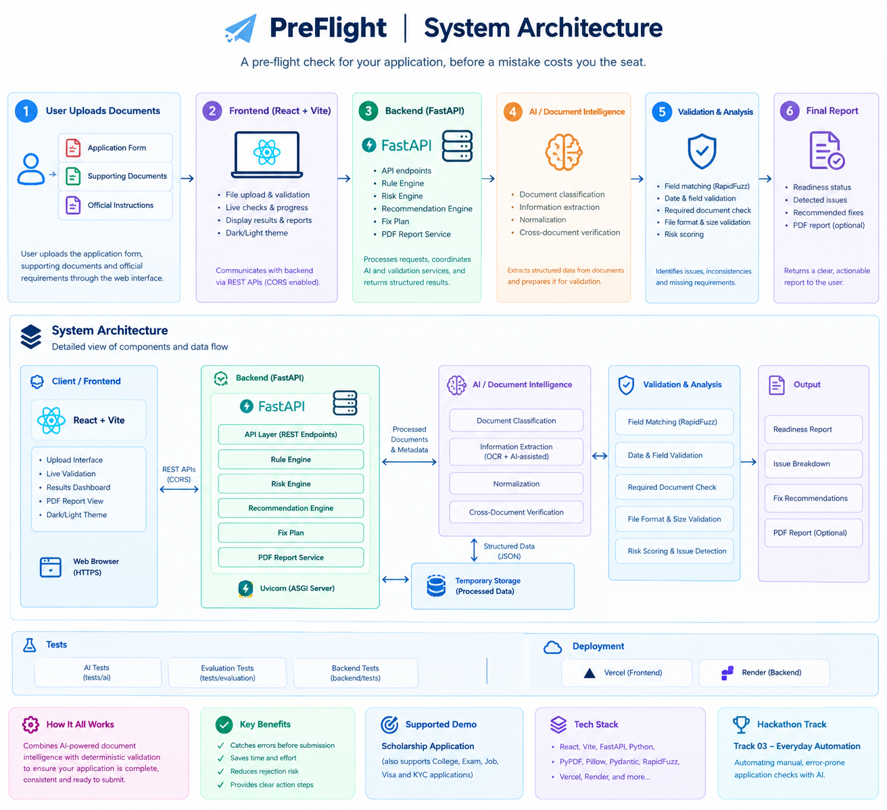
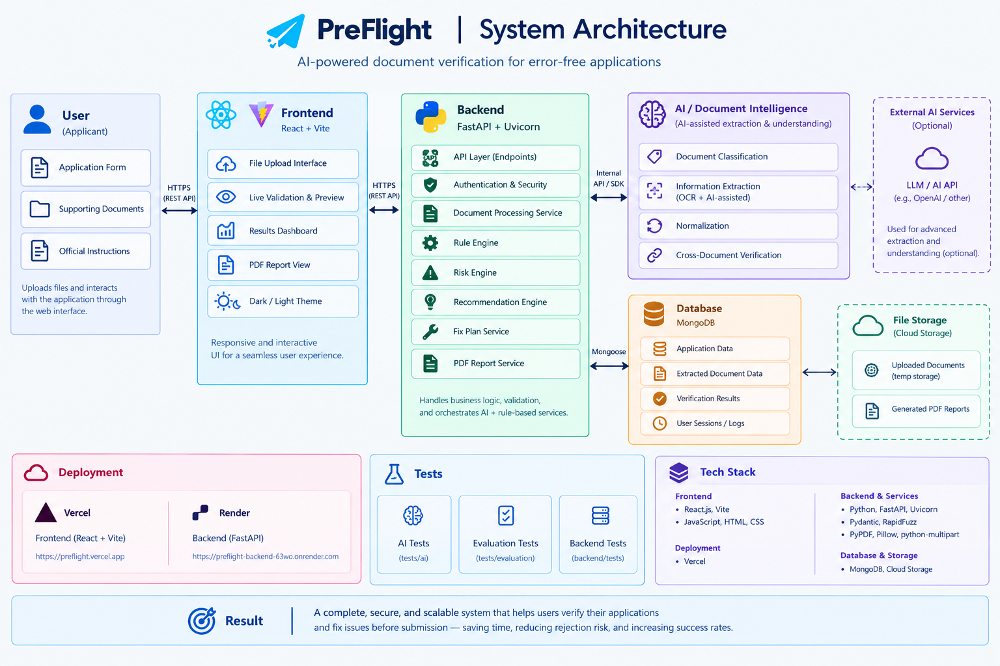

<div align="center">

# ✈️ PreFlight

### A pre-flight check for your application, before a mistake costs you the seat.


[🚀 Live Demo](https://pre-flight-pearl.vercel.app/) · [📘 API Docs](https://preflight-backend-63wo.onrender.com/docs) · [🏗️ Architecture](#system-architecture) · [💻 Run Locally](#run-locally)

**🏆 Hackathon Track 03 — Everyday Automation**

</div>

> ⏳ **Heads up:** the backend runs on Render's free tier and may take **30–60 seconds to wake up** on the first request. If the first upload seems slow, please wait a moment and try again.

<!-- Add a screenshot or GIF of the "Fix These First" result here -->
<!-- <p align="center"></p> -->

---

## Table of Contents

- [Overview](#overview)
- [The Problem](#the-problem)
- [The Solution](#the-solution)
- [Key Features](#key-features)
- [Demo Examples](#demo-examples)
- [How It Works](#how-it-works)
- [System Architecture](#system-architecture)
- [Tech Stack](#tech-stack)
- [Project Structure](#project-structure)
- [Run Locally](#run-locally)
- [Testing](#testing)
- [Privacy](#privacy)
- [Target Users](#target-users)
- [Roadmap](#roadmap)
- [Team](#team)

---

## Overview

PreFlight is an AI-assisted document verification platform that helps applicants detect avoidable mistakes **before** submitting important applications.

It checks application forms, supporting documents, and official requirements to identify inconsistencies, missing documents, and file-related issues, then tells the user exactly what to fix.

**Track 03 — Everyday Automation:** PreFlight automates the repetitive, error-prone process of manually checking multiple documents before submitting an application.

---

## The Problem

Applications for scholarships, exams, visas, bank KYC, and college admissions are often rejected because of small, avoidable mistakes:

- Name or date-of-birth mismatches
- Missing required documents
- Expired certificates
- Incorrect file formats
- File-size violations
- Inconsistent information across documents

Applicants often discover these issues only **after submission or after the deadline**, when it is too late to fix them.

---

## The Solution

PreFlight adds a pre-submission verification layer.

**Users upload:**

- Application form
- Supporting documents
- Official instructions

**PreFlight then:**

1. Extracts the important information from each document
2. Compares documents against each other
3. Checks them against the official requirements
4. Produces a simple, clear verdict:

| Result | Meaning |
| ------ | ------- |
| 🟢 **Ready to Submit** | No blocking issues found |
| 🔴 **Fix These First** | Issues detected, with explanations and recommended actions |

---

## Key Features

- 📄 **Multi-document verification**: check a full application bundle at once
- 🔍 **Cross-document consistency checking**: names, dates, and details must agree
- 🧠 **AI-assisted extraction**: structured data pulled from documents as JSON
- ⚡ **Fuzzy name matching** with RapidFuzz (handles `Rahul K. Sharma` vs `Rahul Kumar Sharma`)
- 📋 **Missing-document detection** against the stated requirements
- 📁 **File format and size validation**
- 💡 **Fix recommendations**: every issue comes with a suggested action
- 📊 **Final readiness report**, with an optional PDF export
- 🌗 **Dark / light theme**

---

## Demo Examples

### Name Mismatch

```text
Aadhaar:
Rahul Kumar Sharma

Marksheet:
Rahul K. Sharma

Result:
⚠ Name mismatch detected
```

### Missing Document

```text
Required Documents:

✓ Identity Proof
✓ Marksheet
✗ Income Certificate

Result:
⚠ Required document missing
```

PreFlight catches these issues **before submission**.

---

## How It Works

```text
Upload Documents
       ↓
Document Processing
       ↓
AI-Assisted Extraction
       ↓
Data Normalization
       ↓
Cross-Document Verification
       ↓
Rule & Requirement Validation
       ↓
Issue Detection
       ↓
Recommendations
       ↓
Ready to Submit / Fix These First
```

---

## System Architecture

### High-Level Flow

<p align="center">
  
</p>

### Detailed Component View

<p align="center">
  
</p>

> Click an image to view it full size.

---

## Tech Stack

| Layer               | Technologies                                        |
| ------------------- | --------------------------------------------------- |
| Frontend            | React.js, Vite, JavaScript, HTML, CSS               |
| Backend             | Python, FastAPI, Uvicorn                            |
| Document Processing | PyPDF, Pillow, python-multipart                     |
| Validation          | Pydantic, RapidFuzz, Rule Engine                    |
| AI                  | AI-assisted document extraction and structured JSON |
| API                 | REST, OpenAPI / Swagger                             |
| Deployment          | Vercel (frontend), Render (backend)                 |

---

## Project Structure

```text
PreFlight/
├── backend/              # FastAPI app: API, rule engine, risk engine, recommendations
│   └── tests/            # Backend tests
├── frontend/             # React + Vite UI
├── tests/
│   ├── ai/               # AI extraction tests
│   └── evaluation/       # Evaluation tests
├── assets/               # Architecture diagrams and screenshots
├── requirements-ai.txt   # Extra dependencies for the AI extraction layer
└── README.md
```

---

## Run Locally

### Prerequisites

- Python 3.10+
- Node.js 18+
- Git

### 1. Clone the repo

```bash
git clone https://github.com/Shravani348/PreFlight.git
cd PreFlight
```

### 2. Backend

```bash
pip install -r backend/requirements.txt
pip install -r requirements-ai.txt
uvicorn backend.main:app --reload --port 8000
```

Backend API docs: <http://127.0.0.1:8000/docs>

### 3. Frontend

```bash
cd frontend
npm install
npm run dev
```

Frontend: <http://localhost:5173>

> 💡 **Windows PowerShell:** if `npm run dev` is blocked by the script execution policy, use `npm.cmd run dev`, or run `Set-ExecutionPolicy -Scope CurrentUser RemoteSigned` once.

---

## Testing

```bash
pytest tests/ai -q
pytest tests/evaluation -q
pytest backend/tests -q
```

---

## Privacy

The prototype is designed to minimize unnecessary storage of sensitive application documents. Documents are processed for verification, and processed data is held only temporarily.

---

## Target Users

- 🎓 Students and scholarship applicants
- 👨‍👩‍👧 Parents filling in application forms
- 🏫 College and exam applicants
- 💼 Job applicants
- 🛂 Visa applicants
- 🏦 Bank KYC users
- 🏢 Small businesses handling document-heavy applications

---

## Roadmap

- [ ] Support for more application templates (visa, bank KYC, job applications)
- [ ] Multi-language document support (Hindi, Marathi, and other regional languages)
- [ ] Automatic masking of sensitive fields such as Aadhaar numbers
- [ ] Image quality checks (blur, cropping, unreadable scans)
- [ ] DigiLocker integration
- [ ] Deadline reminders and a saved checklist per application

---

## Team

| Name | Role | Contribution |
| ---- | ---- | ------------ |
| Shravani Paralkar | Backend & Integration | Developed the FastAPI backend and REST APIs, implemented backend validation and rule integration, connected frontend and backend, and handled deployment and overall system integration. |
| Priti Ahire | AI/ML & Document Intelligence | Worked on AI/ML-based document processing, information extraction, data normalization, and document verification logic. |
| Anupriya | Frontend Development | Developed the React/Vite frontend, including document upload, application screens, verification results, status indicators, and user interface. |

---

## Vision

PreFlight brings a **pre-flight checklist** to important applications.

### Check → Fix → Verify → Submit

**PreFlight — Check before you submit.**
